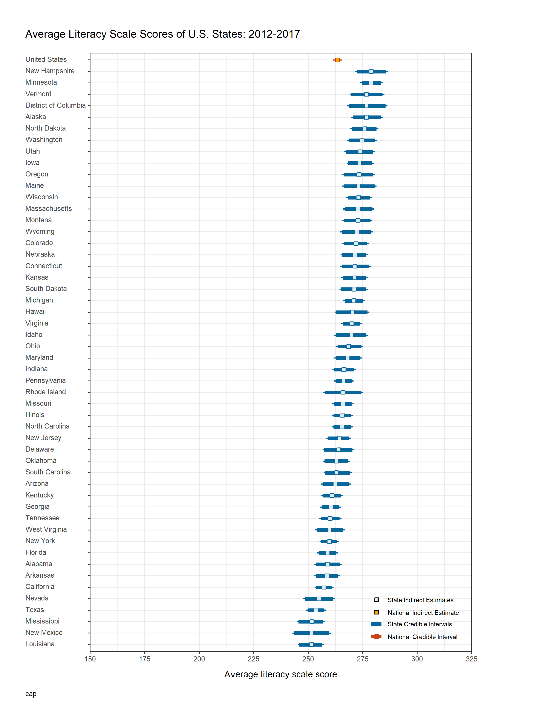

## Introduction 

This project is a showcase of a plot which can visualize the order of estimates from a group of observations/cases, including the corresponding confidence intervals. 

The order could be ascending or descending. 

The non-overlapping confidence intervals could indicate significant differences between the two observations/cases. 

## Data

The data used for this example is publicly available and downloaded from the [PIAAC Skills Map](https://nces.ed.gov/surveys/piaac/skillsmap/).

## Snake/Ranking plot 

This is an example of the snake/ranking plot of the states' average literacy scale scores for all the U.S. states.

